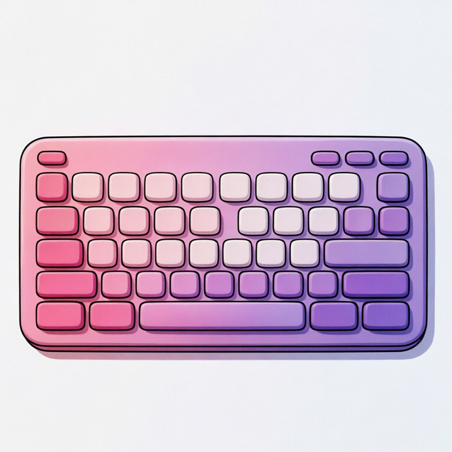

# PastelBoard

PastelBoard 是一款仅面向 Android 的远程蓝牙虚拟触控板与键盘应用，目标是让手机横屏后像一台粉紫色、软萌风格的笔记本电脑键盘，同时可以通过蓝牙 HID 向已配对设备发送真实键位与指针输入。

## 默认视觉方向

- 默认主色：粉色、纯紫色，以及贴近图标的粉紫渐变。
- 主题系统：基于 Material You，整体使用圆角、透明毛玻璃、柔和阴影和软糖感键帽。
- 字体：内置「霞鹜文楷」，风格更柔和，并且支持中文显示。
- 键盘形态：按真实笔记本电脑键盘布局设计，而不是普通输入法键盘。
- 按键反馈：点击键帽会出现原创金色小烟花动画，并播放清脆 Flick 感原创按键音。

## 核心交互

- 启动后先进入设备选择页，让用户选择要连接的蓝牙设备。
- 设备选择页左上角提供菜单入口，菜单内包含设置。
- 连接设备后强制横屏，顶部保留固定切换栏，用于切换「触控板」和「键盘」。
- 设置页支持切换默认颜色配置，也支持 RGB 调色板和 `#RRGGBB` / `#AARRGGBB` 十六进制颜色输入。
- 设置页支持选择本地图片作为应用背景，并调整图片透明度；颜色、背景和按键音设置会保存到本地。

## 构建

本仓库配置了 GitHub Actions：推送到 `main` 或创建 Pull Request 后，会在 GitHub 上执行 Android Debug APK 构建并上传构建产物。

## 当前状态

项目已初始化为 Android Kotlin + Jetpack Compose 工程，包含应用图标、Material You 粉紫主题、设备选择页、设置页、触控板界面、笔记本式虚拟键盘界面、毛玻璃背景系统、按键动效与音效，以及蓝牙 HID 报告发送的基础结构。
